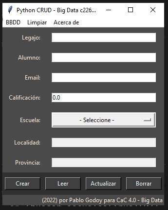

# Codo a Codo 4.0 - Big Data 

## CRUD en Python

Proyecto CRUD que consta de una GUI hecha en `tkinter` y que se conecta a una base de datos hecha en `sqlite3`.

Los paquetes utilizados corresponden a la librería estandar de Python, debería funcionar con cualquier intalación de `Python 3.7` o superior.

### Archivos

- `gui.py` contiene la parte del código que corresponde a la interfaz gráfica.

- `crud.py` contiene la parte funcional, las funciones Create, Read, Update, Delete y otras funciones necesarias para el funcionamiento de la aplicación.

- `listar.py` contiene el código utilizado para mostrar el listado de alumnos.

- `main.py` archivo para ejecutar la aplicación.

### Preview

### Acerca de

Creado por Pablo Godoy para Codo a **Codo 4.0 - Big Data**

Noviembre 2022

Email: `ezpeletense@gmail.com`
